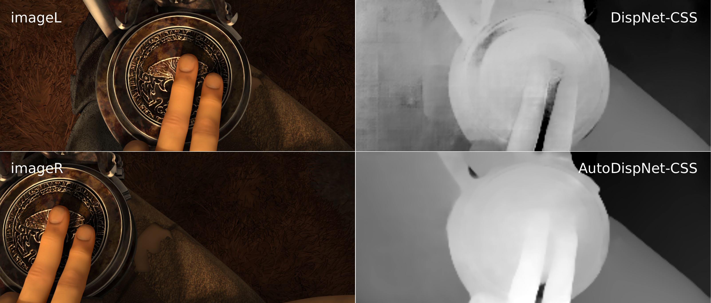

# AutoDispNet
Code for [AutoDispNet: Improving Disparity Estimation with AutoML (ICCV 2019)](https://lmb.informatik.uni-freiburg.de/Publications/2019/SMB19/).

Note: We provide deployment code only.




## Setup
* Compile and install [lmbspecialops](https://github.com/lmb-freiburg/lmbspecialops/tree/eccv18)
* Install [netdef_slim](https://github.com/lmb-freiburg/netdef_slim)
* Clone this repository.

## Running networks
* Change your directory to the network directory (`autodispnet/nets`).
* Download pre-trained weights with `download_weights.sh`.
  Pre-trained weights are provided for networks trained on FlyingThings (CSS) and fine-tuned on KITTI (CSS-KITTI).
* Go to a network directory (Eg: autodispnet/nets/CSS) and use the following command to test the network on an image pair:

  `python3 controller.py eval image0_path image1_path out_dir`
* The output is stored in a binary format with `.float3` extension (Information on reading the output is [here](https://github.com/lmb-freiburg/netdef_models/blob/master/README.md)).

## Citation
If you use the code or parts of it in your research, you should cite the aforementioned paper:
```
@InProceedings{SMB19,
  author       = "T. Saikia and Y. Marrakchi and A. Zela and F. Hutter and T. Brox",
  title        = "AutoDispNet: Improving Disparity Estimation With AutoML",
  booktitle    = "IEEE International Conference on Computer Vision (ICCV)",
  month        = "October",
  year         = "2019",
  url          = "http://lmb.informatik.uni-freiburg.de/Publications/2019/SMB19"
}
```

## Author
Tonmoy Saikia (saikiat@cs.uni-freiburg.de)
